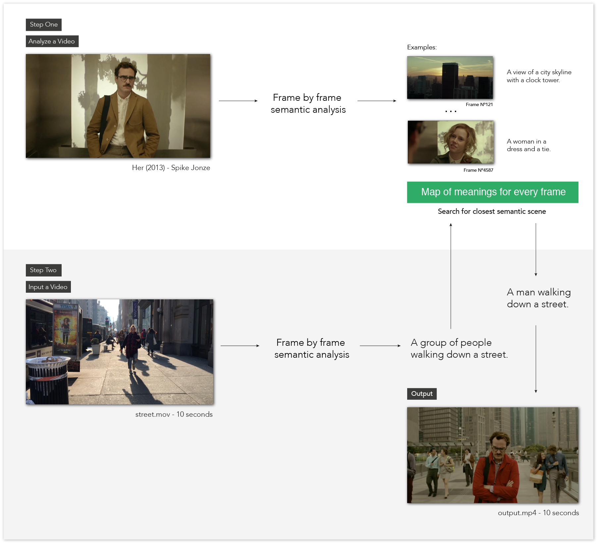
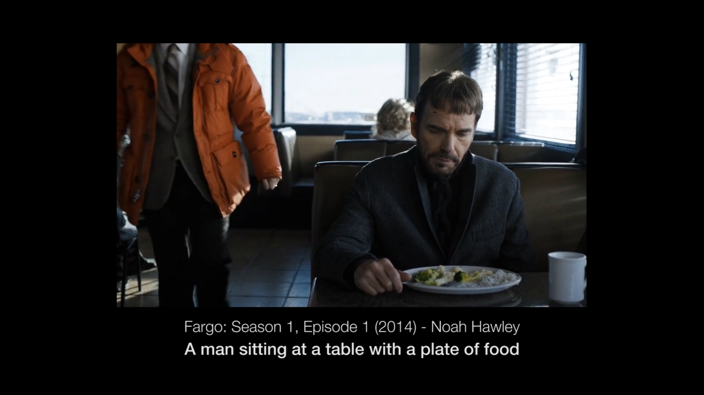
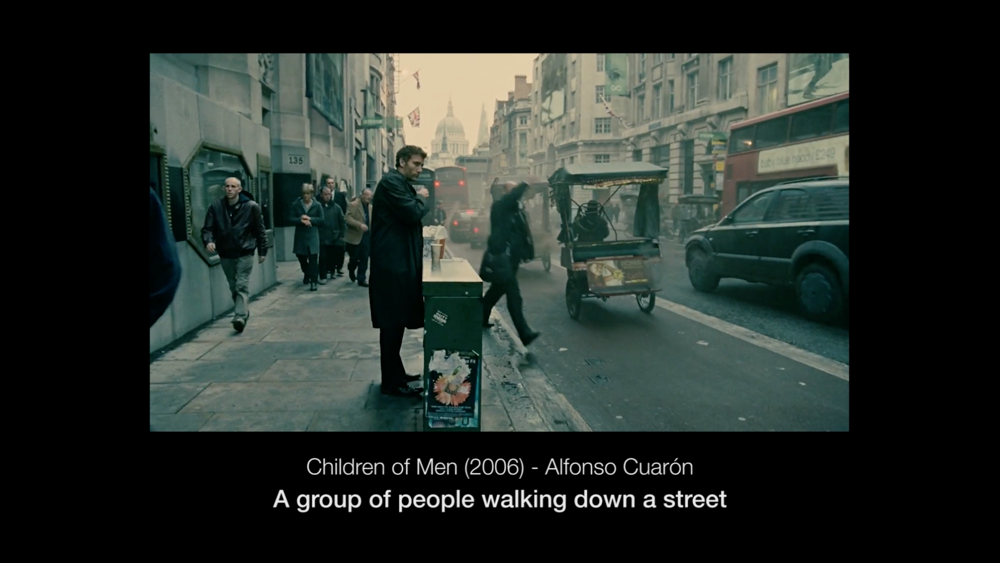

# Scenescoop

Scenescoop is a tool to get similar semantic scenes from a pair of videos. Basically, you input a video and get a scene that has a similar meaning in another video. You can run it as a python script or as a web app.



## How it works

Scenescoop uses the [im2text](https://github.com/tensorflow/models/tree/master/research/im2txt) tensorflow model to analyze videos on a frame to frames basis and get a description of the content of those images. Frames with the same description are grouped together to create a sequence or scene. 

Scenes are then analyzed with [spaCy](https://spacy.io/), for sentence parsing and built-in word vectors, using the average of the word vectors in the sentence. 

[Annoy](https://github.com/spotify/annoy) is finally used to create an index for fast nearest-neighbor lookup (based on [@aparrish](https://github.com/aparrish) [Plot to poem](https://github.com/aparrish/plot-to-poem/blob/master/plot-to-poem.ipynb))

This project is inspired by [Thingscoop](https://github.com/agermanidis/thingscoop).

## Video Demos

### [A man sitting at a table with a plate of food](https://youtu.be/ZF5W_tcnF4s)
[](https://youtu.be/ZF5W_tcnF4s)

### [A group of people walking down the street](https://youtu.be/aaYVMsMMEjc)
[](https://youtu.be/aaYVMsMMEjc)

## Usage

To run this you'll need to install a few dependencies. You can follow the [original repository](https://github.com/tensorflow/models/tree/master/research/im2txt) or the instructions [Edouard Fouché](https://edouardfouche.com/Fun-with-Tensorflow-im2txt/) wrote.
(I plan to write a step-by-step guide on how to install everything)

You can also get the pretrained model I'm using [here](https://drive.google.com/open?id=1tSTzD21qXXOiXlfgJllgXNZ9lREy6yij).

Once everything is installed, clone the repo and install the project dependencies:

```
git clone https://github.com/cvalenzuela/scenescoop.git
cd scenescoop
pip install -r requirements.txt
```

You can then run Scenescoop in two modes:

### 1) Frame Analysis Mode

Given a video file `--video` (.mp4, .avi, .mkv or .mov), this will analyse the file frame by frame and output a `.json` file containing the descriptions of the those frames. The `--name` argument should be the output name of the transcript.

Example:
```
python scenescoop.py --video videos/moonrisekingdom.mp4 --name moonrisekingdom
```

The `.json` file should look something like this:

```
{ 
...
"a person is taking a picture of themselves in a mirror ": [4834], 
"a man sitting in the back of a pickup truck ": [2265, 2266], 
"a man sitting on a bench in front of a building ": [1935, 1937, 
1938, 3950, 3951, 3952, 3953, 3960, 4072, 4073, 4074, 4075, 
4077, 4079, 4080, 4082, 4115, 4467], 
"a man standing next to a tree holding a surfboard ": [2470]
...
}
```

### 2) Transfer Mode

Two videos are required for this mode and both should have their corresponding `transcript.json` file created in the Frame Analysis Mode.

The `--input_data` argument should be the `.json` file containing the data for the input video and `--transform_data` is the `.json` file for the transfer video. `--input_seconds` is the input time frame to transfer and `--transform_src` is the video source of the transfer video. 

Example:
```
python scenescoop.py --input_data transcripts/street.json --input_seconds 0,5 --transform_src videos/her.avi --transform_data transcripts/her.json
```

You can print all options with `python scenescoop.py -h`:

```
usage: scenescoop.py [-h] [--video VIDEO] [--name NAME]
                     [--input_data INPUT_DATA] [--input_seconds INPUT_SECONDS]
                     [--transform_src TRANSFORM_SRC]
                     [--transform_data TRANSFORM_DATA] [--api API]

Storiescoop

optional arguments:
  -h, --help            show this help message and exit
  --video VIDEO         Video Source to transform
  --name NAME           Name of the video
  --input_data INPUT_DATA
                        Input Video. Must be a json file.
  --input_seconds INPUT_SECONDS
                        Input Video Seconds to create transformation. Example:
                        1,30
  --transform_src TRANSFORM_SRC
                        Transform Video Source.
  --transform_data TRANSFORM_DATA
                        Transform Video Data. Must be a json file.
  --api API             API Request
```

## Web App

You can also launch an interactive web app, using a flask server, to run the Frame Analysis Mode and Transfer Mode in a webpage. You'll still need all the dependencies installed.


To run the app in a local server:

```
python server.py
```

The visit `localhost:8080`.

To modify the source code:
```
cd static
yarn watch
```

## MMS

Local development of the MMS application:

Start ngrok
```
./ngrok http 7676
```

Configure the url in Twilio and in the server in `NGROK_URL`

Start the Redis server
```
redis-server
```

Start the Celery worker:
```
celery -A server.celery worker
```

Finally start the server
```
python server.py
```

## License

MIT